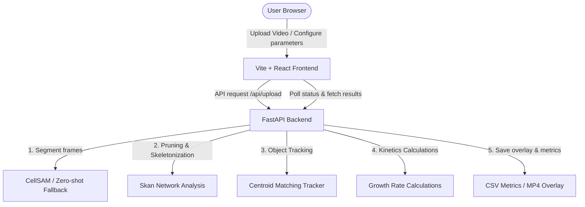

# Fungi AI Pipeline (CellSAM + Growth Tracking)

An automated, lightweight, and highly aesthetic local web application designed for segmenting microscopy slides/videos of fungi and calculating growth dynamics (growth rate, branch points, tip counts, and total length).

Developed for the software side of the **DAPP2 project**.

---

## 1. Architecture Overview

The application is built using a decoupled two-tier architecture tailored for local execution:



*   **Frontend (Vite / React / TypeScript)**: A premium glassmorphic dark UI. It allows drag-and-drop file upload, collapsible parameter adjustments, real-time job status polling, interactive charting (using **Recharts**), and video playback of the segmentation overlay.
*   **Backend (FastAPI / Python)**: A headless analytical pipeline that handles video/TIFF decoding, deep learning segmentation, network graph skeletonization, tracking, and growth rate computations.

---

## 2. Directory Structure

```text
├── backend/
│   ├── main.py                    # FastAPI server endpoints (/api/upload, /api/status, etc.)
│   ├── sam2_pipeline.py           # Core logic: CellSAM wrapper and pipeline orchestration
│   ├── pre_segmentation_setup.py  # Initial ROI extraction and mask preprocessing
│   ├── temporal_continuity.py     # Object persistence and mask alignment across frames
│   ├── bacterial_tracking.py      # Dedicated tracking module for bacteria
│   ├── object_classification.py   # Distinguishes distinct object classes (fungi vs. bacteria)
│   ├── skeleton_branch_nodes.py   # Network graph skeletonization and kinetics calculation
│   ├── annotations.py             # Rendering visual overlays and tracks
│   └── uploads/                   # (Ignored) Temporary folder for uploaded source files
├── frontend/
│   ├── src/
│   │   ├── App.tsx                  # Main React UI, forms, and charting dashboard
│   │   ├── AnnotationView.tsx       # Frame and result viewer component
│   │   ├── PreSegmentationSetup.tsx # Interactive UI for configuring ROIs
│   │   ├── index.css                # Glassmorphism design system & variables
│   │   └── main.tsx                 # React entry point
│   ├── package.json               # Node dependencies
│   └── vite.config.ts             # Vite bundler configuration
├── .gitignore               # Configures git ignores for virtual envs and output artifacts
├── start_mac.command        # Double-click script to run backend/frontend on macOS
└── start_windows.bat        # Double-click script to run backend/frontend on Windows
```

---

## 3. Growth Tracking Mechanics

The pipeline tracks growth kinetics frame-by-frame:

1. **Segmentation**: Generates a binary mask of the fungal structures.
2. **Skeletonization**: Simplifies the binary mask to a 1-pixel-wide topological skeleton using `skimage.morphology.skeletonize`.
3. **Pruning & Length Calculation**:
    - The `skan` library compiles the skeleton into a coordinate node network.
    - Short spurs (segment noise) below the `min_skan_branch_length_px` are pruned.
    - Fungal length is computed as the sum of all remaining branch segment lengths, converted to physical units:
      \[
      \text{length\_um} = \text{length\_px} \times \text{PIXEL\_SIZE\_UM}
      \]
4. **Junction & Tip Counting**: Neighborhood pixel analysis counts terminal endpoints (tips) and junctions (branch points).
5. **Kinetics**: Growth rates are calculated as difference quotients between consecutive frames:
   \[
   \text{length\_growth\_um\_per\_min} = \frac{\Delta \text{length\_um}}{\Delta \text{time\_min}}
   \]
   where \(\Delta \text{time\_min} = \Delta \text{frame\_idx} \times \text{FRAME\_INTERVAL\_MIN}\).

---

## 4. Configurable Hyperparameters

Adjustable directly in the UI settings drawer:

*   **Pixel Size (\(\mu m\)/px)**: Physical size of a pixel. Crucial for scaling. Default: `1.0`.
*   **Frame Interval (min)**: Capture rate of your time-lapse frames. Default: `1.0`.
*   **Min Object Size (px)**: Filters out small binary noise fragments. Default: `40`.
*   **Dilation/Cleanup Radius (px)**: Used to reconstruct the tubular boundaries of the hyphae. Decrease for thin filaments, increase for thick ones. Default: `8`.
*   **DeepCell Access Token**: Token required to authenticate weight downloads for the CellSAM model.

---

## 5. Setup & Local Run

### Prerequisites
*   Python 3.10+
*   Node.js (for frontend compilation, although pre-installed packages exist)
*   **DeepCell Token** (Optional, required for CellSAM): Register for a free token at [users.deepcell.org](https://users.deepcell.org) to unlock CellSAM.

### Launching the Application
Double-click the launcher script for your operating system:
- **macOS**: `start_mac.command`
- **Windows**: `start_windows.bat`

### Google Colab
To run in Google Colab (single port, GPU runtime), see [`colab/README.md`](colab/README.md) and open [`colab/Fungi_Colab.ipynb`](colab/Fungi_Colab.ipynb).

The script will automatically:
1. Create a local virtual environment (`.venv`) and install FastAPI, PyTorch, Skan, and OpenCV.
2. Clone and install the CellSAM model package.
3. Boot up the backend (port 8000) and frontend (port 5173) concurrently.
4. Open your web browser to `http://localhost:5173`.

### Model Fallback
If no token is supplied, if weights cannot download, or if CellSAM fails on a frame, the backend automatically falls back to **zero-shot fluorescence thresholding**. The application will still output full metrics, graphs, and videos without crashing.
