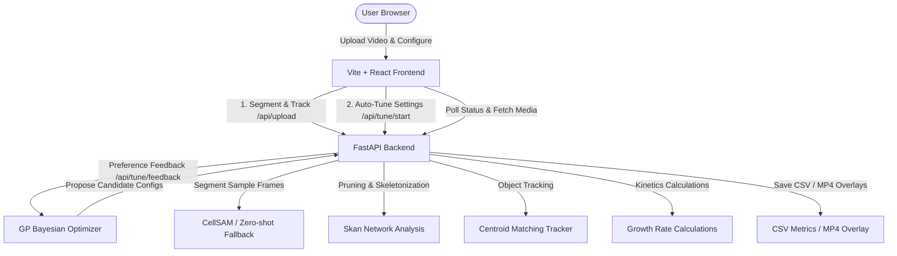

# Fungi AI Pipeline (CellSAM + Parameter Tuning)

An automated, lightweight local web application designed for segmenting time-lapse microscopy slides of fungi and calculating growth dynamics (growth rate, branch points, tip counts, and total hyphal length). 

It features an integrated **preference-based parameter auto-tuner** to optimize segmentation settings on custom datasets via Gaussian Process active learning, and is styled with a retro-scientific instrument aesthetic.

---

## 1. Architecture Overview

The system is split into a local decoupled React frontend and FastAPI backend:



*   **Frontend (Vite / React / TypeScript)**: A custom-built scientific interface using `Space Mono` and `Silkscreen` fonts with a flat, amber-themed panel aesthetic. It includes settings adjustments, real-time job status polling, interactive charting (using **Recharts**), and a 2x2 preference comparison window.
*   **Backend (FastAPI / Python)**: Processes video/TIFF stacks, runs CellSAM segmentation (or zero-shot fallback), performs skeleton network analysis, runs the centroid object tracker, and hosts the Gaussian Process parameter tuner.

---

## 2. Directory Structure

```text
├── backend/
│   ├── main.py              # FastAPI server endpoints (/api/upload, /api/tune/*, etc.)
│   ├── sam2_pipeline.py     # Core analytical pipeline: CellSAM segmentation, skeletonization & tracking
│   ├── tuner.py             # Preference-based Gaussian Process active learning parameter tuner
│   └── uploads/             # (Ignored) Uploaded files and cached frame/mask images
├── frontend/
│   ├── src/
│   │   ├── App.tsx          # Dual-mode React dashboard (Analysis & Auto-Tune)
│   │   ├── index.css        # CSS variable tokens and retro scanline stylesheet
│   │   └── main.tsx         # React entry point
│   ├── package.json         # Frontend metadata and dependencies
│   └── README.md            # Frontend development and style guide
├── legacy/
│   └── legacy_tkinter_prototype.py  # Standalone legacy Tkinter GUI prototype (unreferenced)
├── .gitignore               # Configured to ignore .venv, node_modules, checkpoints, and temporary caches
├── start_mac.command        # Double-click script to run backend/frontend on macOS
└── start_windows.bat        # Double-click script to run backend/frontend on Windows
```

---

## 3. Growth Tracking Mechanics

The pipeline tracks growth kinetics frame-by-frame:

1. **Segmentation**: Generates a binary mask of the fungal structures.
2. **Skeletonization**: Simplifies the binary mask to a 1-pixel-wide topological skeleton using `skimage.morphology.skeletonize`.
3. **Pruning & Length Calculation**:
    - The `skan` library compiles the skeleton into a coordinate node network.
    - Short spurs (segment noise) below the `min_skan_branch_length_px` threshold are pruned.
    - Fungal length is computed as the sum of all remaining branch segment lengths, scaled to physical units:
      \[
      \text{length\_um} = \text{length\_px} \times \text{PIXEL\_SIZE\_UM}
      \]
4. **Junction & Tip Counting**: Neighborhood pixel analysis counts terminal endpoints (tips) and junctions (branch points).
5. **Kinetics**: Growth rates are calculated as difference quotients between consecutive frames:
   \[
   \text{length\_growth\_um\_per\_min} = \frac{\Delta \text{length\_um}}{\Delta \text{time\_min}}
   \]
   where \(\Delta \text{time\_min} = \Delta \text{frame\_idx} \times \text{FRAME\_INTERVAL\_MIN}\).

---

## 4. Preference-Based Parameter Auto-Tuning

When segmenting crowded or noisy images, manual parameter adjustment is tedious. The auto-tuner optimizes 4 key hyperparameters through active human feedback:

| Hyperparameter | Bounds | Description |
| :--- | :--- | :--- |
| `dilation_radius` | 2 – 20 px | Radius for binary dilation to close hyphal gaps. |
| `min_object_size_px` | 10 – 200 px | Minimum size filter to remove isolated noise spots. |
| `nearby_margin_px` | 3 – 30 px | Pixel distance to group adjacent hyphae segment endpoints. |
| `min_skan_branch_length_px` | 3 – 25 px | Minimum length threshold below which branch spurs are pruned. |

### Active Learning Loop
1. **Multi-Frame Extraction**: The backend extracts up to 5 evenly spaced frames from the video/TIFF stack.
2. **Initial Pool**: Generates 4 diverse candidate parameter settings (1 baseline default + 3 spaced configurations).
3. **Overlay Composites**: Segmentations are generated for all 5 frames. The overlays for each candidate are stacked vertically using `numpy.vstack` into a single tall image, showing the researcher how the settings perform across different time points (critical for verifying clump handling).
4. **Active Selection**: The researcher selects the best option in the 2x2 grid.
5. **Bayesian Optimization update**:
   - The selected candidate is assigned a pseudo-score of `1.0`; the other three are assigned `0.0`.
   - A **Gaussian Process Regressor** with a **Matérn kernel** (\(\nu = 2.5\)) is fitted on all feedback history.
   - The next 4 candidates are chosen from a pool of 1,000 using the **Upper Confidence Bound (UCB)** acquisition function (\(\text{UCB} = \mu + 2.0\sigma\)), filtered with a diversity check to ensure candidates are spaced by at least \(0.25\) normalized Euclidean distance.
6. **Convergence**: After 6 rounds, the best configuration is returned and can be applied directly to the main analysis dashboard.

---

## 5. API Endpoints

### Pipeline Endpoints
- **`POST /api/upload`**:
  Uploads a time-lapse file and parameters. Starts an asynchronous background task.
  - *Form fields*: `file`, `pixel_size_um`, `frame_interval_min`, `min_object_size_px`, `dilation_radius`, `deepcell_token`
  - *Returns*: `{"job_id": "...", "status": "processing"}`
- **`GET /api/status/{job_id}`**:
  Checks background task status. Returns `completed` or `failed` (with traceback).
- **`GET /api/results/{job_id}`**:
  Returns summary statistics and time-series data for charting.
- **`GET /api/media/video`**:
  Serves the raw MP4 video showing the segmented overlay.
- **`GET /api/media/metrics_csv`**:
  Serves the exported raw CSV metrics spreadsheet.

### Parameter Tuning Endpoints
- **`POST /api/tune/start`**:
  Initiates a tuning session. Segmentations are computed for up to 5 sampled frames and cached in memory.
  - *Form fields*: `file`, `deepcell_token`
  - *Returns*: `{"session_id": "...", "round": 1, "candidates": [...], "num_frames": 5}`
- **`POST /api/tune/feedback`**:
  Submits feedback for a round, updates the GP model, and generates the next round of candidates.
  - *Form fields*: `session_id`, `winner_idx`
  - *Returns*: Next candidates or the final best settings.
- **`GET /api/tune/media/{session_id}/{candidate_idx}.png`**:
  Serves the tall vertical composite overlay image containing the stacked frames.

---

## 6. Setup & Local Run

### Prerequisites
- Python 3.10+
- Node.js (for frontend compilation)
- **DeepCell Token** (Optional, required for CellSAM): Register at [users.deepcell.org](https://users.deepcell.org). If missing, the backend will auto-fallback to zero-shot fluorescence thresholding.

### Run Launcher
Double-click the startup script for your operating system:
- **macOS**: `start_mac.command`
- **Windows**: `start_windows.bat`

The script will automatically create a `.venv`, run `ensure_dependencies()` in Python to install requirements (FastAPI, PyTorch, CellSAM, Skan, Scikit-Learn, OpenCV), install node modules, launch the backend and frontend dev servers concurrently, and open `http://localhost:5173`.
